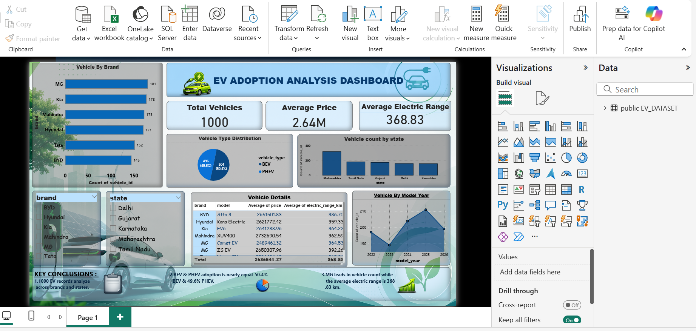

# 🚗 Electric Vehicle Adoption Analysis

## 📌 Project Overview

This project analyzes Electric Vehicle (EV) adoption trends across different regions and years using SQL and Power BI.

The objective is to identify EV adoption patterns, growth trends, regional performance, and key factors influencing electric vehicle adoption.

## 🎯 Objectives

- Analyze EV adoption trends over time
- Compare EV adoption across regions
- Identify high-growth and low-growth markets
- Analyze EV market penetration
- Create interactive dashboards for data-driven insights

## 🛠️ Tools & Technologies

- **SQL** – Data extraction, cleaning and analysis
- **PostgreSQL** – Database management
- **Power BI** – Interactive dashboard and visualization
- **Microsoft Excel** – Data preparation
- **GitHub** – Project documentation and version control

## 📊 Dataset

The dataset contains approximately 1,000 records related to Electric Vehicle adoption.

Key data points include:

- Year
- Region
- EV Adoption
- EV Sales
- Market information
- Growth-related metrics

## 🔄 Project Workflow

1. Collected and prepared the EV dataset
2. Imported the dataset into PostgreSQL
3. Performed data cleaning and transformation using SQL
4. Analyzed EV adoption trends using SQL queries
5. Connected the data with Power BI
6. Created KPIs, charts and interactive visualizations
7. Developed an interactive EV Adoption Dashboard
8. Identified key business insights

## 🗄️ SQL Analysis

SQL was used to perform:

- Data filtering and aggregation
- Year-wise analysis
- Region-wise analysis
- EV adoption analysis
- Growth analysis
- Market comparison
- KPI calculations

## 📈 Power BI Dashboard

The Power BI dashboard provides an interactive view of:

- Total EV Adoption
- EV Growth Trends
- Regional EV Adoption
- Year-wise EV Trends
- Market Performance
- Interactive slicers and filters

## 📸 Dashboard Preview



## 🔑 Key Findings

- EV adoption shows an overall increasing trend over the analyzed period.
- Some regions demonstrate significantly higher EV adoption than others.
- Growth patterns vary across regions and years.
- Interactive Power BI visualizations help identify important EV market trends.

## 📁 Project Structure

```text
EV-Adoption-Analysis-Dashboard/
│
├── README.md
├── EV_Dataset.csv
├── EV_Adoption_Analysis.sql
├── EV_Adoption_Dashboard.pbix
└── EV_Dashboard.png

## 🚀 Conclusion
This project demonstrates the use of SQL and Power BI to transform raw EV adoption data into meaningful business insights and an interactive analytical dashboard.

## 👩‍💻 Author

**Komal Lembhe**

Data Analyst Aspirant
